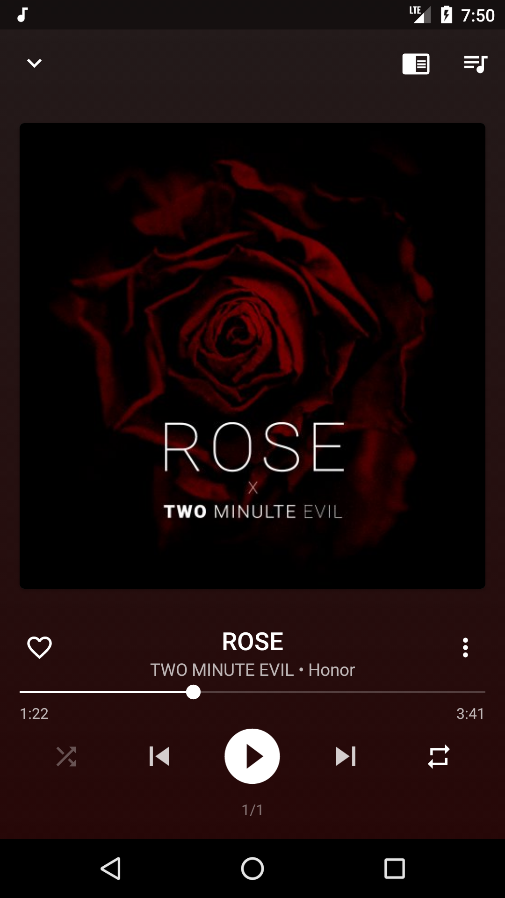

# CoffeeMusicPlayer

Coffee Music Player a simple yet powerful music player for a special music experience. Available on [PlayStore][5]

Special features
----------------
* Simple and elegant design.
* Advanced instant lyrics with offline access.
* Folder browser.
* Build in 5 band Equalizer, Bassboost & Virtualizer.
* Automatic artist art, tags and bio downloading.
* ID3 tag editing with album art and metadata fetching.
* Personalizable home screen widget.

Standard features
-----------------
* Supports the standard music file formats such as MP3, WAV, OGG & Flac support.
* Playlist creation & editing with special favorites section.
* Lock screen playback controls.
* Clean notification.

Created By
----------
Udesh Kumarasinghe - [UdeshUK][1] on GitHub, [TheUdeshUK][2] on Twitter

License
-------
Apache 2.0. See the [LICENSE][3] file for details.

Feedback
--------
Any support, hugs and bugs to improve this music experience is warmly appreciated. Email to [this][4]

[1]: https://github.com/UdeshUK
[2]: https://twitter.com/TheUdeshUK
[3]: https://github.com/UdeshUK/CoffeeMusicPlayer/blob/master/LICENSE.txt
[4]: mailto:udesh.upalanka@live.com
[5]: https://play.google.com/store/apps/details?id=com.udeshcoffee.android
